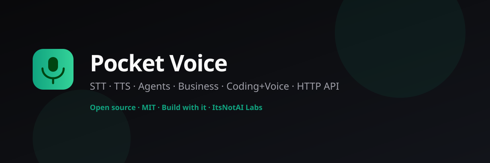

<p align="center">
  
</p>

<h1 align="center">Pocket Voice API</h1>

<p align="center">
  <strong>Own your voice stack.</strong> Patient listening · semantic turn-taking · multi-personality agents · business CS · coding+voice<br/>
  Open-source (MIT) alternative to closed $/min voice SaaS.
</p>

<p align="center">
  
  
  
  
  
</p>

<p align="center">
  <a href="terminal.html"></a>
  &nbsp;
  <a href="saas-dashboard.html"></a>
  &nbsp;
  <a href="https://railway.app/new/template?template=https://github.com/ItsNotAILABS/pocket-voice-to-text"></a>
  &nbsp;
  <a href="https://render.com/deploy?repo=https://github.com/ItsNotAILABS/pocket-voice-to-text"></a>
</p>

<p align="center"></p>

---

## 🚀 Try It Now

```bash
git clone https://github.com/ItsNotAILABS/pocket-voice-to-text.git
cd pocket-voice-to-text
npm start          # API on :8790
```

Then open **[terminal.html](terminal.html)** in your browser for an interactive shell, or run:

```
╔══════════════════════════════════════════════════════════════╗
║  ⚡  SOVEREIGN TERMINAL  ─  Pocket Voice API                 ║
╠══════════════════════════════════════════════════════════════╣
║                                                              ║
║  $ GET /v1                                                   ║
║  → API catalog, all endpoints, version                       ║
║                                                              ║
║  $ POST /v1/turn {"text":"my flight is delayed","scenario":"patient"}
║  → patient turn + personalities + context buffer             ║
║                                                              ║
║  $ POST /v1/turn/decide {"transcript":"my flight is","silence_ms":900}
║  → end: false  (semantic incomplete, threshold ~1400ms)      ║
║                                                              ║
║  $ POST /v1/saas/checkout {"tier":"free","email":"me@co.com"}
║  → api_key: pv_…  (instant free-tier provisioning)          ║
║                                                              ║
║  $ GET /v1/flows                                             ║
║  → travel_recovery · code_pair · support_escalate · …       ║
╚══════════════════════════════════════════════════════════════╝
```

> **[→ Open Sovereign Terminal](terminal.html)** — full interactive shell, presets, history, live API

---

## Why not just buy a closed voice API?

Funded platforms ship great latency and telephony — and **lock you into $/minute**.

| | Closed voice SaaS | **Pocket Voice** |
|--|-------------------|------------------|
| Price | ~$0.05–0.21/min | **Self-host $0** |
| Source | Closed | **MIT — fork it** |
| Turn-taking | Black box | **Patient 1400ms + semantic + stress** |
| Personas | Prompt glue | Built-in CS / sales / travel experts |
| Context | Per vendor | **Cross-domain buffer** (hotel ↔ shuttle ↔ airport) |
| STT | Vendor ASR | **Own hybrid STT** (energy VAD + Web Speech + optional host Whisper) |
| Agents | Single prompt | **Agentic multi-step flows** (travel recovery, code pair, …) |
| Fusion | n/a | **Metadata → POCKET Deep Fusion** |
| Best for | Instant phone scale | Products you **own** (and can still plug Deepgram/ElevenLabs under) |

We open-sourced this so companies can **mess with real turn-taking** — not just consume a blob.

---

## Patient VAD (the product moat)

| Scenario | Silence | Use |
|----------|---------|-----|
| Fast command / sales | 200–400 ms | Snappy |
| Standard | 500–800 ms | Balanced |
| **Patient / travel / healthcare** | **1000–1500 ms (default 1400)** | Stressed callers, multi-part answers |
| Dictation | 2000+ ms | Account numbers, addresses |

**Hybrid end-of-turn**

1. Silence threshold (scenario + stress + active expert)  
2. Semantic incompleteness → *don't cut* on “ummm…”, trailing “and”, mid-digits  
3. Optional energy / Silero hook (`energy`, `speech_active`)  
4. Medium barge-in by default (cancel TTS when user clearly speaks)

```bash
curl -s localhost:8790/v1/turn/decide -H "Content-Type: application/json" \
  -d '{"transcript":"my flight is","silence_ms":900,"scenario":"patient"}'
# → end: false  (semantic_incomplete, threshold ~1400)
```

---

## Own STT (v1.1)

```js
// Browser
const stt = PocketVoiceSTTPocket.create({ engine: "hybrid", hostSttUrl: "http://127.0.0.1:8787" });
stt.start(); // energy VAD + webspeech; optional host /v1/voice/stt
```

| Engine | What |
|--------|------|
| `hybrid` | **Default** — MediaStream energy + Web Speech |
| `pocket` | Energy VAD + optional host ASR |
| `webspeech` | Browser SpeechRecognition only |

API: `GET /v1/stt/engines` · `POST /v1/stt/transcribe`  
POCKET: `POST /v1/voice/stt` (sovereign host bridge)

## Agentic flows (v1.1)

Multi-step playbooks on the voice stack:

| Flow | When |
|------|------|
| `travel_recovery` | Delay · hotel · shuttle · dining |
| `code_pair` | Voice pair programming |
| `support_escalate` | CS calm escalate |
| `morning_brief` | Day priorities |
| `founder_sanctuary` | Focus / ship |

```bash
curl -s localhost:8790/v1/flows
curl -s localhost:8790/v1/flows/advance -H "Content-Type: application/json" \
  -d '{"text":"my flight is delayed and I need the hotel"}'
```

Turns return `agentic_flow` + `fusion` metadata for POCKET.

## Install & sell

```bash
git clone https://github.com/ItsNotAILABS/pocket-voice-to-text.git
cd pocket-voice-to-text
npm test          # all green
npm start         # API :8790
npm run demo      # browser demos
```

### API for customers / friends

```bash
# Open local
npm start

# SaaS mode (billing routes, tiers, admin panel)
SAAS_MODE=1 MASTER_KEY=secret npm run saas

# Production with real Stripe
SAAS_MODE=1 MASTER_KEY=secret \
  STRIPE_SECRET_KEY=sk_live_… \
  STRIPE_WEBHOOK_SECRET=whsec_… \
  STRIPE_PRICE_PRO=price_… \
  STRIPE_PRICE_TEAM=price_… \
  REQUIRE_API_KEY=1 npm run saas

# Mint a key (master only)
curl -s localhost:8790/v1/keys -H "Authorization: ******" \
  -H "Content-Type: application/json" -d '{"name":"acme","product":"business"}'
```

Docs: **[docs/API.md](docs/API.md)** · Products: `GET /v1/products`

```bash
curl -s localhost:8790/v1/turn -H "Content-Type: application/json" -d '{
  "text": "When is hotel check-in?",
  "scenario": "patient",
  "expert": "hotel_host",
  "stress": 0.5,
  "context": { "hotel": { "check_in": "4:00 pm", "room": "1204" } }
}'
```

---

## Features

- **Voice → text** continuous (browser Web Speech + patient wrapper)  
- **Voice → voice** agent loop (STT → brain → TTS)  
- **Personalities** support · sales · reception · coder · executive · founder  
- **Business modes** customer_service · sales · reception · ops  
- **Travel experts** Airport Guide · Transit · Hotel Host · Dining  
- **Cross-domain context buffer** (shuttle times + room + flight)  
- **Coding + voice** dictate + commands while you work  
- **HTTP API** keys, rate limits, products, sessions  
- **Zero npm deps** runtime  
- **SaaS layer** tenant provisioning, Stripe billing, usage metering, admin panel  

---

## SaaS Tiers

Self-host free forever. Paid tiers for the managed hosted offering.

| Tier | Price | RPM | Turns/day | Highlights |
|------|-------|-----|-----------|------------|
| **Free** | $0 | 60 | 500 | Self-host · sandbox · patient VAD |
| **Pro** | $29/mo | 600 | 50 000 | All personalities · agentic flows · custom brain hook |
| **Team** | $149/mo | 3 000 | 500 000 | Multi-key (5 seats) · hospitality experts · usage dashboard · SLA 99.5% |
| **Enterprise** | Contact | 20 000 | Unlimited | On-prem · SSO · HIPAA-ready hosting · custom VAD hooks |

```bash
# Provision free key instantly
curl -s localhost:8790/v1/saas/checkout \
  -H "Content-Type: application/json" \
  -d '{"tier":"free","email":"you@example.com"}'
# → { "ok": true, "api_key": "pv_…", "tier": "free" }

# List SaaS tiers
curl -s localhost:8790/v1/tiers
```

**[→ Open SaaS Dashboard](saas-dashboard.html)** — tier cards, instant key provisioning, usage stats, admin panel

### Environment variables

| Variable | Purpose |
|----------|---------|
| `SAAS_MODE=1` | Enable SaaS routes (`/v1/tiers`, `/v1/saas/*`, `/v1/admin/*`) |
| `MASTER_KEY` | Admin access — list tenants, suspend, upgrade |
| `STRIPE_SECRET_KEY` | Real Stripe payments (omit → stub mode) |
| `STRIPE_WEBHOOK_SECRET` | Webhook HMAC verification |
| `STRIPE_PRICE_PRO` | Stripe price ID for Pro tier |
| `STRIPE_PRICE_TEAM` | Stripe price ID for Team tier |
| `FRONTEND_URL` | Redirect URL after Stripe checkout |
| `REQUIRE_API_KEY=1` | Enforce API keys on all write routes |

---

## Sovereign Terminal

An in-browser interactive shell that talks directly to your running API.

**[→ terminal.html](terminal.html)**

```
╔══════════════════════════════════════════════════════════════╗
║  ⚡  SOVEREIGN TERMINAL                                      ║
╠══════════════════════════════════════════════════════════════╣
║  ❯ GET /v1                         → catalog                 ║
║  ❯ POST /v1/turn {"text":"help"}   → patient turn            ║
║  ❯ POST /v1/saas/checkout {"tier":"free"} → api_key: pv_…   ║
║  ❯ GET /v1/flows                   → agentic flows           ║
║  ❯ help                            → command reference       ║
╚══════════════════════════════════════════════════════════════╝
```

Features: syntax-highlighted JSON · preset library (30+ commands) · ↑↓ history · API key storage · live health indicator · works against any running instance.

---

## Demos

| Page | What |
|------|------|
| [index.html](index.html) | STT |
| [terminal.html](terminal.html) | **⚡ Sovereign Terminal** |
| [saas-dashboard.html](saas-dashboard.html) | **SaaS Dashboard — tiers, keys, usage** |
| [demo-patient.html](demo-patient.html) | **1400ms patient travel mic** |
| [demo-voice-agent.html](demo-voice-agent.html) | Personalities |
| [demo-business.html](demo-business.html) | CS / sales |
| [demo-coding.html](demo-coding.html) | Code + talk |

---

## Architecture

```
Browser mic ──► Patient STT (hybrid turn machine)
                    │
Friends/apps ──► HTTP API ──► Engine
                               ├─ business + personality
                               ├─ context buffer
                               ├─ optional LLM brain
                               └─ tts_hint
```

Plug Silero / Deepgram / ElevenLabs **under** this control plane when you need raw model quality. Keep **patience + personas + buffer** as your open core.

---

## Use with POCKET

Main product: [POCKET](https://github.com/ItsNotAILABS/pocket)

```
POST pocket:8787/v1/sandbox/voice  →  voice-api:8790/v1/turn
```

Agents get `voice:api` capability only — no ambient host FS.

---

## License

MIT © ItsNotAI Labs

**Ship voice you own.** Customer service · co-working · educators · personas — open source first.
